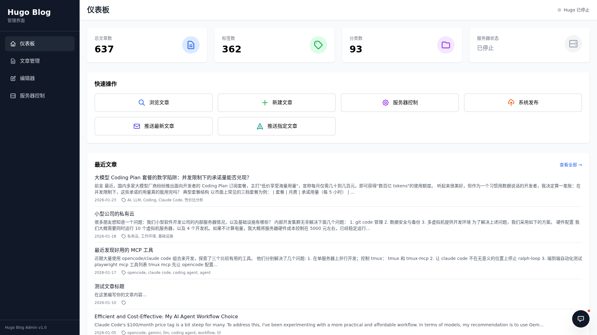

# Hugo Admin

[](LICENSE)
[](https://go.dev/)
[](https://gohugo.io/)
[](https://sun-praise.github.io/hugo-admin/)

[中文](README.zh-CN.md) | English

> **Version Notice**
>
> - **`main` (v3)** — Active development. Backend fully rewritten in **Go**
>   (single binary, gRPC plugins, SSE realtime). This is the branch you want.
> - **`v2`** — The previous Python/Flask implementation, kept in
>   **maintenance mode** (security fixes only, no new features). The full
>   Python history lives there; see the
>   [v2 → v3 migration notes](#v2--v3-migration) below.

## Screenshot



## Features

- **📊 Dashboard**: Overview of blog statistics and quick actions
- **📝 Post Management**: Browse, search, and filter posts by category and tags
- **✏️ Markdown Editor**: Online editing with optimistic locking, clipboard image paste, AI frontmatter suggestions, TTS generation
- **🚀 Hugo Server Control**: Start/stop Hugo dev server with real-time logs (SSE)
- **🔍 Advanced Search**: Full-text search with category and tag filtering
- **⚡ Real-time Updates**: SSE-based live event streaming
- **🔐 Password Login**: Single-admin authentication gates every API and the realtime channel
- **🔌 Plugin System**: Extend hugo-admin with gRPC-based plugins — see [`proto/plugin.proto`](proto/plugin.proto)
- **🤖 AI Assistant**: Blog-aware chat, inline rewrite, article import with AI-enriched frontmatter and cover generation
- **📧 Email Push**: Push latest posts to subscribers via listmonk
- **🎨 Theme Management**: Discover, install, preview, and activate Hugo themes

## Tech Stack (v3)

- **Backend**: Go 1.24+ — standard library `net/http`, `modernc.org/sqlite` (CGO-free), `grpc-go`, `trpc-agent-go`
- **Frontend**: React + TypeScript + Vite + Tailwind CSS
- **Realtime**: Server-Sent Events (`/api/events`), automatic fallback to Socket.IO when connecting to a v2 backend
- **Storage**: SQLite (shared schema with v2), YAML frontmatter files
- **Plugins**: gRPC subprocesses with Fernet-encrypted config (key shared with v2)

## Quick Start

```bash
# Build frontend
cd frontend && pnpm install && pnpm build && cd ..

# Build & run (defaults: port 5050, auth store data/auth.json)
go build -o hugo-admin ./cmd/hugo-admin
./hugo-admin

# Or via environment:
AUTH_STORE=/path/to/auth.json \
HUGO_ROOT=/path/to/blog \
CONTENT_DIR=/path/to/blog/content \
PORT=8961 ./hugo-admin
```

### Docker

```bash
docker build -f Dockerfile-go -t hugo-admin-go .
docker run -p 5050:5050 -v ~/.hugo-admin:/root/.hugo-admin -v /path/to/blog:/blog \
  -e HUGO_ROOT=/blog hugo-admin-go
```

### Configuration

| Env | Default | Description |
|-----|---------|-------------|
| `PORT` | `5050` | HTTP listen port |
| `SECRET_KEY` | dev default | Session signing key (same semantics as v2) |
| `AUTH_STORE` | `data/auth.json` | Credential file (werkzeug-compatible hashes) |
| `HUGO_ROOT` | cwd | Hugo site root |
| `CONTENT_DIR` | `<HUGO_ROOT>/content` | Content directory |
| `AI_API_KEY` / `AI_BASE_URL` / `AI_MODEL` | — | AI provider config |
| `OPENROUTER_API_KEY` | — | Cover image generation |

## v2 → v3 Migration

The v3 backend is a line-by-line behavioral port of v2, verified by a
**105-sample API contract suite** (`contracts/api_samples.jsonl`) that gets
replayed against the Go implementation in CI. Key compatibility guarantees:

- **Session cookies are interchangeable** — a browser logged into v2 is
  logged into v3, and vice versa (same itsdangerous HMAC scheme).
- **`auth.json` credentials are shared** — werkzeug scrypt/pbkdf2 hashes
  verified by both implementations.
- **SQLite is shared** — push history and chat sessions written by one
  implementation are readable by the other (`~/.hugo-admin/` Fernet key
  likewise shared for plugin config).
- **The frontend runs against either backend** — the realtime layer prefers
  SSE (v3) and falls back to Socket.IO (v2) automatically.

Known behavioral differences (documented in commit messages):

- Changing the Hugo root in Settings requires a service restart in v3
  (v2 hot-swapped service instances).
- `save_file` YAML output uses yaml.v3 (double-quoted strings, indented
  block lists) vs PyYAML — semantically equivalent, Hugo parses both.
- The posts cache is a direct filesystem scan (no SQLite cache layer);
  `/api/cache/stats` reports live counts.

## Development

```bash
go build ./... && go vet ./...
go test ./... -count=1              # 10 packages, includes contract replay

# Record new API contract samples (requires a v2 checkout for the pytest recorder):
# RECORD_CONTRACT=1 CONTRACT_OUT=contracts/api_samples.jsonl pytest tests/

cd frontend && pnpm build           # rebuild admin-ui
```

## License

Apache-2.0 — see [LICENSE](LICENSE)
