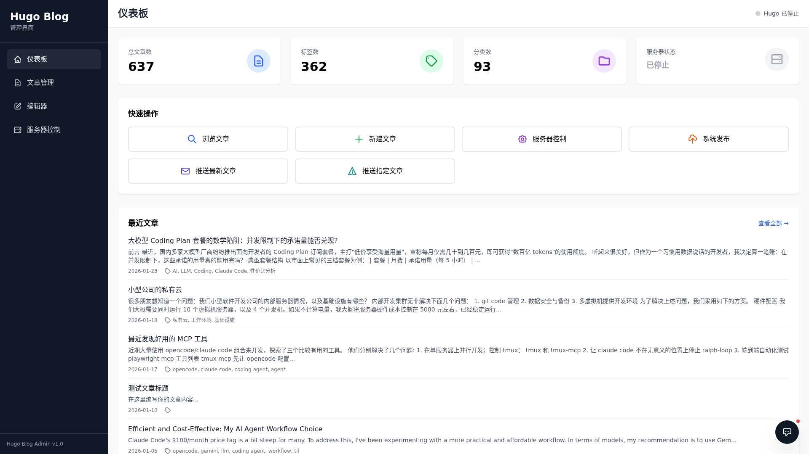

# Hugo Admin

[](https://github.com/Svtter/hugo-admin/actions)
[](https://github.com/Svtter/hugo-admin/blob/main/LICENSE)
[](https://www.python.org/downloads/)
[](https://sun-praise.github.io/hugo-admin/)
[](https://gohugo.io/)
[](https://github.com/psf/black)

中文 | [English](README.md)

## 截图



## 功能特性

- **📊 仪表板**: 博客统计信息和快速操作概览
- **📝 文章管理**: 按分类和标签浏览、搜索和筛选文章
- **✏️ Markdown 编辑器**: 在线编辑，支持自动保存和快捷键
- **🚀 Hugo 服务器控制**: 启动/停止 Hugo 开发服务器，实时日志
- **🔍 高级搜索**: 全文搜索，支持分类和标签过滤
- **⚡ 实时更新**: 基于 WebSocket 的实时日志流
- **💾 缓存系统**: 基于 SQLite 的缓存，快速检索文章
- **🔐 密码登录**: 单管理员认证，保护所有 API 与实时通道

## 技术栈

- **后端**: Flask + Flask-SocketIO
- **前端**: Tailwind CSS + Alpine.js
- **实时通信**: WebSocket (Socket.IO)
- **进程管理**: psutil
- **数据库**: SQLite (用于缓存)

## 安装
### Docker（推荐）
从 GHCR 拉取镜像并使用 Docker Compose 启动：
```bash
# 克隆仓库
git clone https://github.com/Svtter/hugo-admin.git
cd hugo-admin
# 启动服务
docker compose up -d
```
在浏览器中打开 `http://127.0.0.1:5050`。
卷挂载和环境变量请参考 [docker-compose.yml](docker-compose.yml)，根据实际 Hugo 站点目录结构调整挂载路径。
### 手动安装
#### 环境要求
- Python 3.9+
- Hugo (已安装并在 PATH 中)
#### 安装步骤
1. 克隆仓库:
```bash
git clone https://github.com/Svtter/hugo-admin.git
cd hugo-admin
```
2. 安装依赖:
```bash
pip install .
```
3. 配置应用:
```bash
cp config.py config_local.py
# 编辑 config_local.py 设置你的 Hugo 根目录
```
4. 运行应用:
```bash
python app.py
```
5. 在浏览器中打开 `http://127.0.0.1:5050`

## 配置

编辑 `config.py` 或创建 `config_local.py` 进行自定义:

```python
# Hugo 根目录 (content/ 的父目录)
HUGO_ROOT = '/path/to/your/hugo/site'

# 内容目录
CONTENT_DIR = HUGO_ROOT + '/content'

# Hugo 服务器设置
HUGO_SERVER_PORT = 1313
HUGO_SERVER_HOST = '127.0.0.1'
```

## 使用说明

### 仪表板
- 查看博客统计信息（文章数、标签数、分类数）
- 检查 Hugo 服务器状态
- 快速访问常用操作
- 最近文章概览

### 文章管理
- 分页浏览所有文章
- 按标题、内容、标签或分类搜索文章
- 按特定分类或标签筛选
- 点击任意文章进入编辑

### 编辑器
- 编辑 Markdown 文件，支持语法高亮
- 自动保存更改
- 键盘快捷键：`Ctrl+S` / `Cmd+S` 保存
- 实时保存状态指示器

### 服务器控制
- 启动 Hugo 服务器（支持草稿模式）
- 停止运行中的服务器
- 查看服务器状态（PID、运行时间、CPU、内存）
- 实时日志流

## 开发

### 运行测试

```bash
# 安装开发依赖
pip install -r requirements-dev.txt

# 运行所有测试
pytest

# 运行测试并生成覆盖率报告
pytest --cov=. --cov-report=html
```

### 项目结构

```
hugo-admin/
├── app.py                 # Flask 应用
├── config.py              # 配置文件
├── pyproject.toml         # 依赖和项目元数据
├── Dockerfile             # Docker 镜像构建
├── docker-compose.yml     # Docker Compose 配置
├── pytest.ini             # Pytest 配置
├── services/              # 业务逻辑层
├── routes/                # Flask 蓝图（API 路由）
├── frontend/              # React + Vite SPA
├── tests/                 # 测试套件
```

## 贡献

欢迎贡献！请随时提交 Pull Request。对于重大更改，请先开 issue 讨论您想要更改的内容。

1. Fork 本仓库
2. 创建特性分支 (`git checkout -b feature/AmazingFeature`)
3. 提交更改 (`git commit -m 'Add some AmazingFeature'`)
4. 推送到分支 (`git push origin feature/AmazingFeature`)
5. 开启 Pull Request

## 安全性

- **需要登录**：所有 `/api/*` 接口与 SocketIO 实时通道都受密码会话保护，未登录请求返回 `401`。
- 首次启动会创建默认 `admin`/`admin` 账户——对外暴露前请用 `ADMIN_USERNAME`/`ADMIN_PASSWORD` 覆盖，或登录后在应用内改密。
- 密码仅以加盐哈希存储（`werkzeug.security`），凭据存放在 `data/auth.json` 且不会提交到仓库；凭据文件损坏/不可读时启动会中止（fail closed），绝不静默重置管理员。
- 文件操作限制在 `content` 目录内，含路径遍历保护。
- 生产环境请设置强 `SECRET_KEY`，并将服务放在可信网络或反向代理之后。

## 开发路线图

- [x] 基础框架
- [x] Hugo 服务器控制
- [x] 文章浏览和搜索
- [x] Markdown 编辑器
- [x] Markdown 预览
- [x] SQLite 缓存系统
- [x] 测试套件与 CI/CD
- [x] 图片上传和管理
- [x] Docker 支持
- [x] Git 操作界面
- [x] 基于密码的管理员登录
- [ ] 批量操作
- [ ] 多用户支持

## 文档

完整文档（部署、使用、开发、变更日志）已部署到 GitHub Pages：

**https://sun-praise.github.io/hugo-admin/**

主要章节：

- [Docker 部署](https://sun-praise.github.io/hugo-admin/docker/)
- [快速开始](https://sun-praise.github.io/hugo-admin/QUICKSTART/)
- [缓存使用](https://sun-praise.github.io/hugo-admin/CACHE_USAGE/)
- [GitHub 设置](https://sun-praise.github.io/hugo-admin/GITHUB_SETUP/)
- [Frontmatter 重构](https://sun-praise.github.io/hugo-admin/FRONTMATTER_REFACTOR/)

使用 [MkDocs Material](https://squidfunk.github.io/mkdocs-material/) 构建，源文件在 [`docs/`](docs/)，由 [`.github/workflows/pages.yml`](.github/workflows/pages.yml) 自动部署。

## 许可证

Apache License 2.0 - 详见 [LICENSE](LICENSE) 文件

## 致谢

为 Hugo 社区用 ❤️ 构建。
